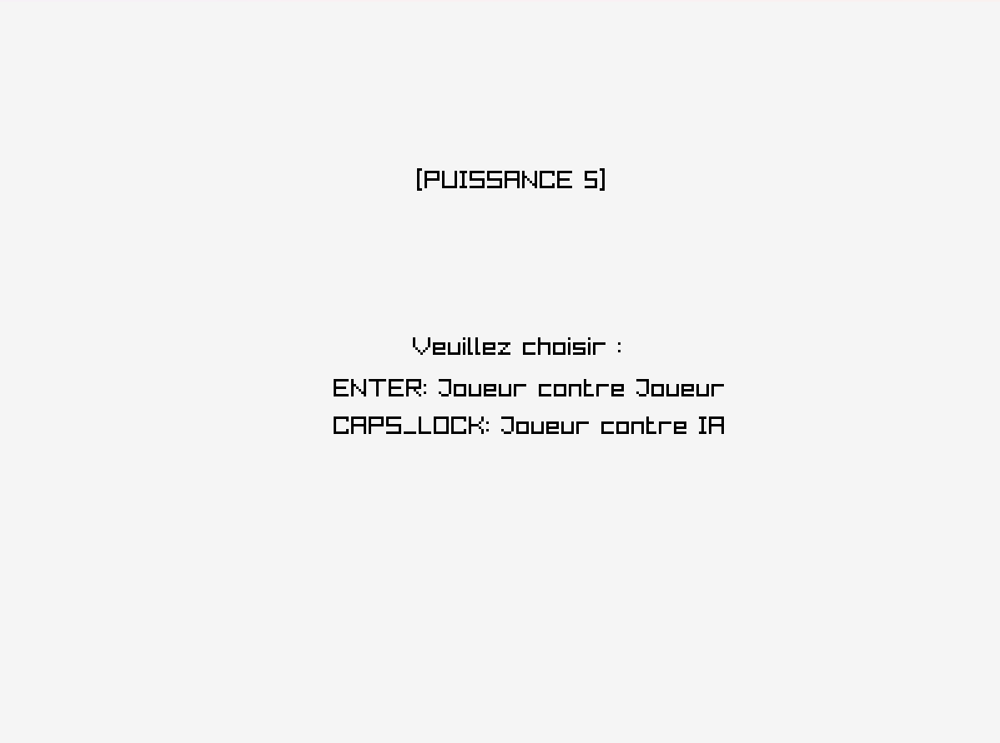
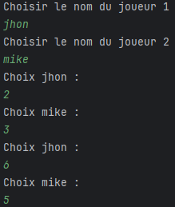
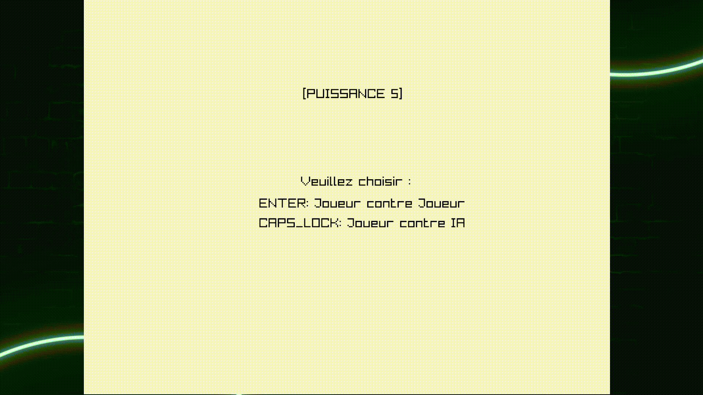

# Puissance 5

### Description

C'est un jeu de puissance 5 en C++ avec interface graphique (raylib) et IA (minmax)

### Features

- Joueur vs Joueur
- Joueur vs IA

### Controls
Au debut, un presse ENTRER pour le mode "Joueur contre Joueur" ou VERMAJ (CAPSLOCK) pour le mode "Joueur contre IA".

Le jeu ce joue via la console en entrant un nombre entre 1 et 7 car raylib ne permet pas d'inputs directement via la fenêtre de jeu.

### Screenshots

### TODO

Il y a un bug avec le fichier CMakeCache.txt, pour l'instant les autres personne qui veulent profiter du jeu ne peuvent pas.
Je pense que l'erreur se trouve dans CMakeList.txt.